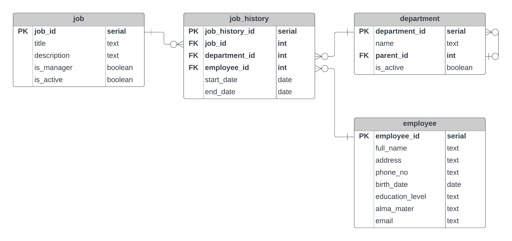
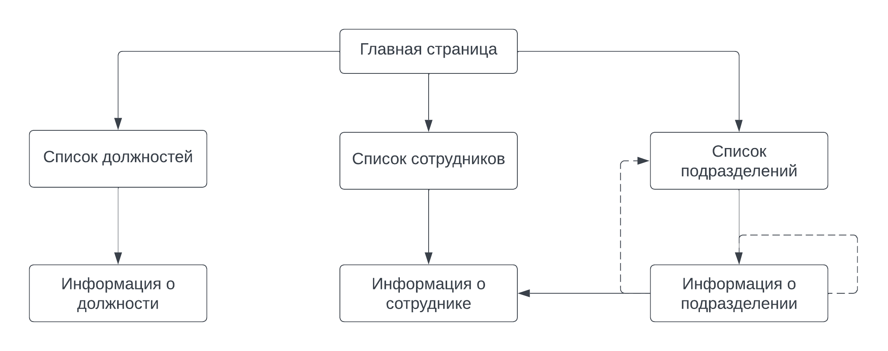

## Схема базы данных


Поля `job.is_active` и `department.is_active` являются индикаторами того, что должность или подразделение в данный момент действительны. При удалении должности, которую когда-либо занимали, соответствующий ей кортеж не удаляется из таблицы, а лишь поле `job.is_active` изменяется на `FALSE`. Аналогично при удалении расформированного подразделения. Это позволяет поддерживать историю должностей сотрудников в корректном состоянии, не нарушая нормализации.
Поле `job.is_manager` содержит информацию о том, является ли эта должность руководящей в каком-либо подразделении. Позволяет находить руководителя подразделения без образования связи
```SQL 
FOREIGN KEY("manager_id") REFERENCES "employee"("employee_id") 
```
в таблице `department`, которая приводит к циклу. Например, чтобы найти руководителя IT-отдела нужно выполнить следующий запрос
```SQL
SELECT e.full_name
FROM department d 
    JOIN job_history jh USING (department_id)
    JOIN job j USING (job_id) 
    JOIN employee e USING (employee_id)
WHERE
    d.name = 'Отдел IT'
    AND j.is_manager
    AND jh.end_date IS NULL;
```
Текущая должность представлена в виде отрытого интервала (значением `end_date` является `NULL`). При снятии сотрудника с должности или при назначении на новую интервал закрывается значением `CURRENT_DATE`.

## Схема навигации между страницами

Дополнительно с каждой страницы можно перейти на главную.

## Описание страниц
### Главная страница
- Ссылка на страницу **Список должностей** со списком всех должностей;
- Ссылка на страницу **Список сотрудников** со списком всех сотрудников;
- Ссылка на страницу **Список подразделений** со списком всех подразделений.

### Список должностей
- Список ссылок с названием должностей. Каждая ссылка переводит на страницу **Информация о должности**;
- Поиск должности по названию;
- Кнопка `Добавить должность` - переводит на страницу с формой добавления новой должности.

### Информация о должности
- Содержит информацию о должности:
    - Название;
    - Описание обязанностей.
- Список ссылок с полными именами сотрудников, занимающих эту должность;
- Кнопка `Редактировать должность` - переводит на страницу с формой редактирования данных о должности;
- Кнопка `Удалить должность` с подтверждением - доступна только если никто не занимает эту должность как текущую. Если эту должность никто не занимал, она действительно удаляется, иначе она помечается неактивной.

### Список сотрудников
- Список ссылок с полными именами сотрудников. Каждая ссылка переводит на страницу **Информация о сотруднике**;
- Кнопка `Добавить сотрудника` - переводит на страницу с формой добавления нового сотрудника;
- Поиск сотрудника по ФИО;
- Фильтр сроку работы.

### Информация о сотруднике
- Содержит информацию о сотруднике:
    - Полное имя;
    - Адрес;
    - Электронная почта;
    - Образование;
    - Номер телефона;
    - Текущая должность и подразделение;
    - Общий срок работы в компании.
- Содержит историю должностей. Таблица со всеми должностями, которые сотрудник когда-либо занимал. Каждая запись содержит:
    - Название должности;
    - Подразделение;
    - Дата назначения должности;
    - Дата снятия с должности (пустое значение для текущей должности);
    - Срок нахождения на должности.
- Кнопка `Редактировать сотрудника` - переводит на форму с редактированием данных о сотруднике (без редактирования должности и подразделения).
- Кнопка `Снять с должности` с подтверждением (закрывает интервал значением `CURRENT_DATE`);
- Кнопка `Назначить на новую должность` - переводит на страницу с формой назначения сотрудника на новую должность в нужном подразделении;
- Кнопка `Удалить сотрудника` с подтверждением - удаляет всю информацию о сотруднике (включая историю должностей).

### Список подразделений
- Список ссылок с названиями подразделений. Каждая ссылка переводит на страницу **Информация о подразделении**;
- Поиск подразделения по названию;
- Кнопка `Добавить подразделение` - переводит на страницу с формой добавления нового подразделения.

### Информация о подразделении
- Содержит информацию о подразделении:
    - Название;
    - Ссылка на страницу **Информация о сотруднике** руководителя;
    - Ссылка на страницу **Информация о подразделении** головного подразделения, если таковое имеется;
    - Ссылка на страницу **Список подразделений** со списком всех внутренних подразделений, если таковые имеются;
    - Список сотрудников. Таблица. Каждая запись содержит ссылку с полным именем сотрудника на страницу **Информация о сотруднике** и название должности, которую он занимает в этом подразделении;
    - Список должностей. Таблица. Каждая запись содержит название должности, которую в данный момент кто-то занимает в этом подразделении и количество таких сотрудников.
- Кнопка `Редактировать подразделение` - переводит на страницу с формой редактирования данных о подразделении;
- Кнопка `Добавить внутреннее подразделение` - переводит на страницу с формой добавления нового внутренного подразделения. Можно добавить подразделение, для которого ещё не задано головное;
- Кнопка `Сбросить головное подразделение` с подтвеждением.
- Кнопка `Удалить подразделение` с подтверждением - доступна только для расформированного подразделения (у него нет внутренних подразделений и нет ни одной текущей должности в этом подразделении). Если в подразделении никто не работал, то оно действительно удаляется, иначе оно помечается неактивным.

## Сценарии использования
### Работа с должностями
- Чтение информации о должности:
    - **Главная** → **Список должностей** → **Информация о должности**.
- Редактирование информации о должности:
    - **Главная** → **Список должностей** → **Информация о должности** → `Редактировать должность`.
- Добавить новую должность:
    - **Главная** → **Список должностей** → `Добавить должность`.
- Удалить должность:
    - **Главная** → **Список должностей** → **Информация о должности** → `Удалить должность`.

### Работа с сотрудниками
- Получить список всех сотрудников:
    - **Главная** → **Список сотрудников**.
- Получить список сотрудников подразделения:
    - **Главная** → **Список подразделений** → **Информация о подразделении**.
- Получить список сотрудников, занимающих должность:
    - **Главная** → **Список должностей** → **Информация о должности**.
- Получить список сотрудников, занимающих нужную должность в нужном подразделении:
    - **Главная** → **Список подразделений** → **Информация о подразделении**.
- Получить список сотрудников по сроку работы:
    - **Главная** → **Список сотрудников** → Применить фильтр по сроку работы.
- Добавить нового сотрудника:
    - **Главная** → **Список сотрудников** → `Добавить сотрудника`.
- Чтение информации о сотруднике и его история должностей:
    - **Главная** → **Список сотрудников** → **Информация о сотруднике**.
- Редактировать данные сотрудника:
    - **Главная** → **Список сотрудников** → **Информация о сотруднике** → `Редактировать сотрудника`.
- Снять сотрудника с должности:
    - **Главная** → **Список сотрудников** → **Информация о сотруднике** → `Снять с должности`.
- Назначить сотрудника на новую должность:
    - **Главная** → **Список сотрудников** → **Информация о сотруднике** → `Назначить на новую должность`.
- Удалить сотрудника:
    - **Главная** → **Список сотрудников** → **Информация о сотруднике** → `Удалить сотрудника`.

### Работа с подразделениями
- Получить список подразделений:
    - **Главная** → **Список подразделений**.
- Чтение информации о подразделении:
    - **Главная** → **Список подразделений** → **Информация о подразделении**.
- Получить список внутренних подразделений нужного подразделения:
    - **Главная** → **Список подразделений** → **Информация о подразделении**.
- Получить информацию о головном подразделении нужного подразделения:
    - **Главная** → **Список подразделений** → **Информация о подразделении** → **Информация о подразделении** головного подраздления.
- Получить информацию о руководителе подразделения:
    - **Главная** → **Список подразделений** → **Информация о подразделении** → **Информация о сотруднике** руководителя.
- Добавить новое подразделение:
    - **Главная** → **Список подразделений** → `Добавить подразделение`.
- Редактировать информацию о подразделении:
    - **Главная** → **Список подразделений** → **Информация о подразделении** → `Редактировать подразделение`.
- Добавить внутреннее подразделение:
    - **Главная** → **Список подразделений** → **Информация о подразделении** → `Добавить внутреннее подразделение`.
- Удалить подразделение:
    - **Главная** → **Список подразделений** → **Информация о подразделении** → `Удалить подразделение`.