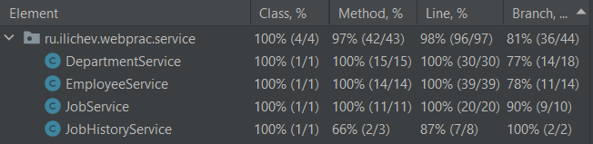

## Классы хранимых объектов
Находятся в пакете [models](../src/main/java/ru/ilichev/webprac/models).

Отображение БД на объекты задано с помощью аннотаций `@Entity` и `@Table`. 
Конфигурация Hibernate и настройки для подключения к БД заданы в файле 
[application.properties](../src/main/resources/application.properties). 

## Взаимодействие с БД
Осуществляется с помощью JPA-репозиториев в пакете [repo](../src/main/java/ru/ilichev/webprac/repo).
Помимо методов, которые приезжают из коробки, были реализованы дополнительные типовые методы
с помощью [механизма, который предоставляет JPA](https://docs.spring.io/spring-data/jpa/docs/current/reference/html/#jpa.query-methods.query-creation). 
Запросы посложнее используют аннотацию `@Query` и диалект `HQL`.

## Бизнес логика
Предоставляется контроллерам сервисами в пакете [service](../src/main/java/ru/ilichev/webprac/service). 
Для взаимодествия с БД сервисы используют описанные выше репозитории.

## Модульное тестирование
Тестирование сервисов и сбор покрытия осуществлялся средствами `IntelliJ IDEA`. 

Тестирование логики удаления должности и подразделения (описана в [отчете к 1 этапу](FIRSTSTAGE.md)) осуществлялось
 подменой репориториев Mock-объектами средствами фреймворка `Mockito`. Сами тесты находятся в классах
[JobServiceDeleteLogic](../src/test/java/ru/ilichev/webprac/service/JobServiceDeleteLogicTest.java) и
[DepartmentServiceDeleteLogic](../src/test/java/ru/ilichev/webprac/service/JobServiceDeleteLogicTest.java).

Для остальных [тестов](../src/test/java/ru/ilichev/webprac/service) создана тестовая БД, параметры подключения к которой заданы в 
[application.properties](../src/test/resources/application.properties), а также [скрипты](../src/test/resources/scripts), которые
заполняют таблицы необходимым для тестов содержимым *перед* каждым тестом и удаляют это содержимое *после* каждого теста.
Такое поведение достигается с помощью аннотации `@Sql` на уровне класса с тестами.

Покрытие методов сервисов этими тестами представлено на рисунке ниже:

Непокрытым остался лишь тривиальный save-метод.

Непокрытые `if` операторы появляются в результате нарушения контракта `@NonNull`:
