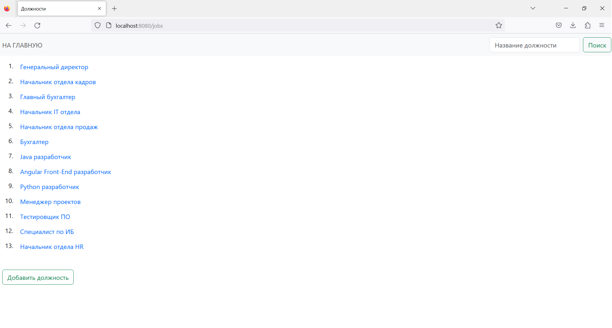
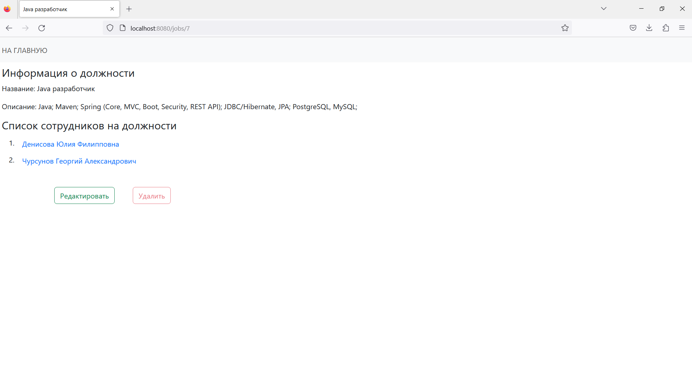
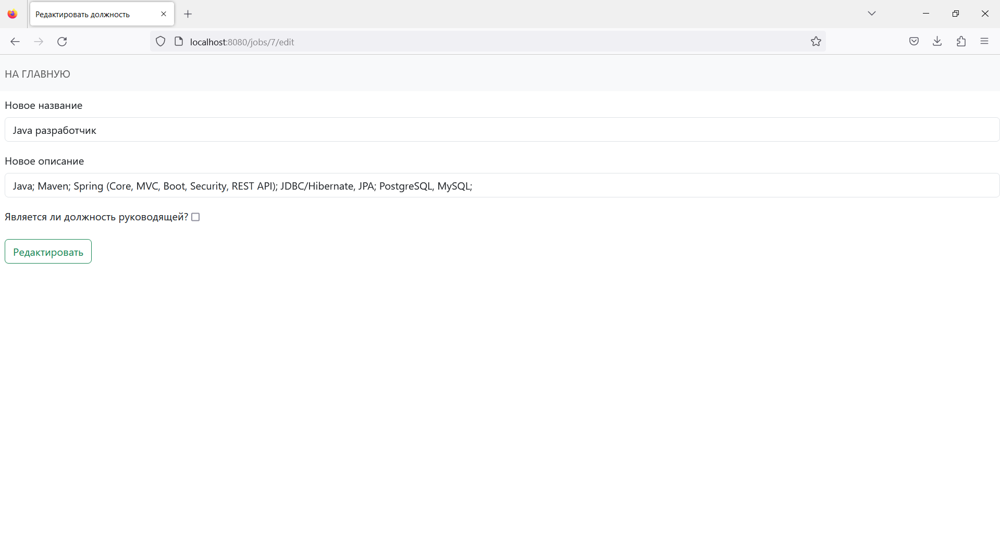
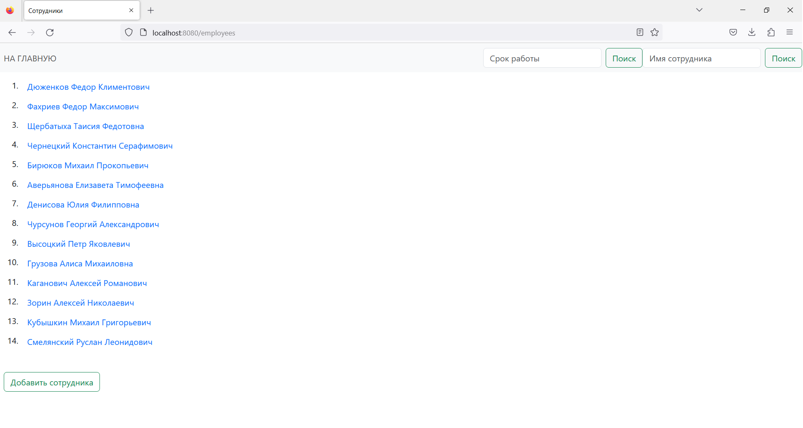
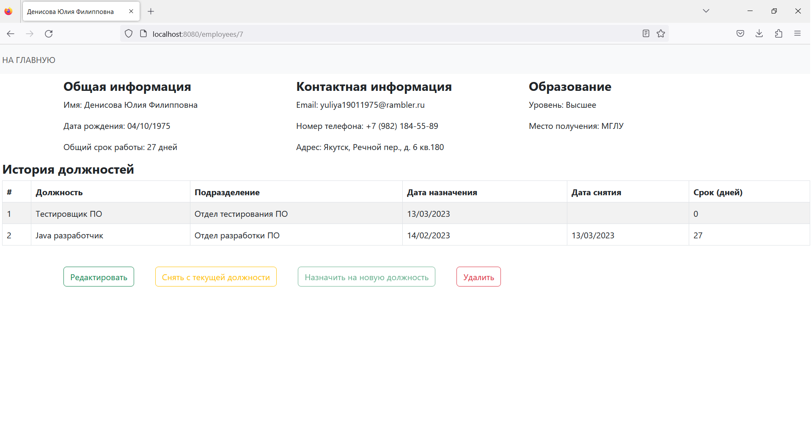
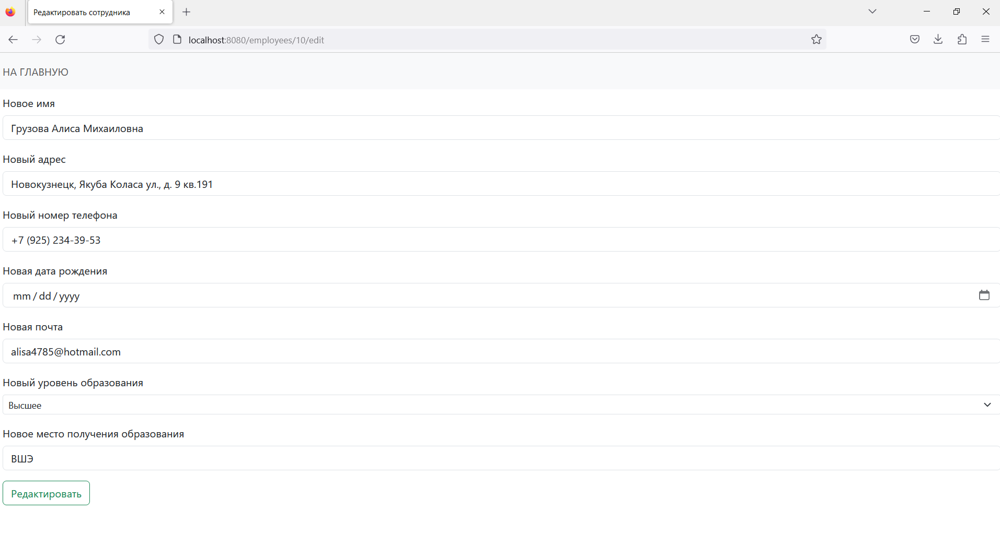
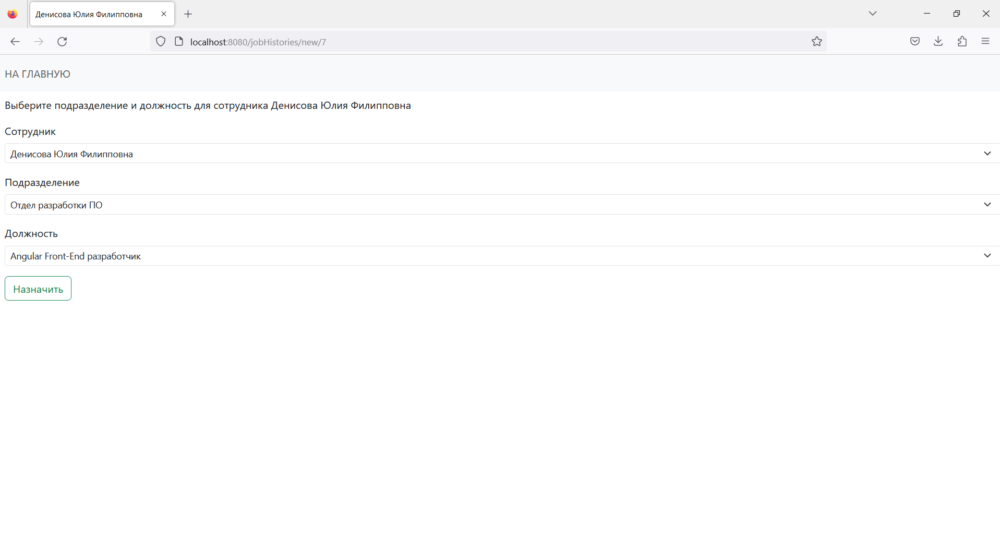
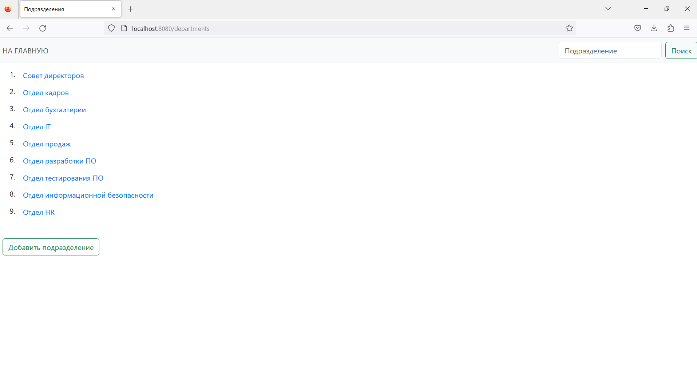
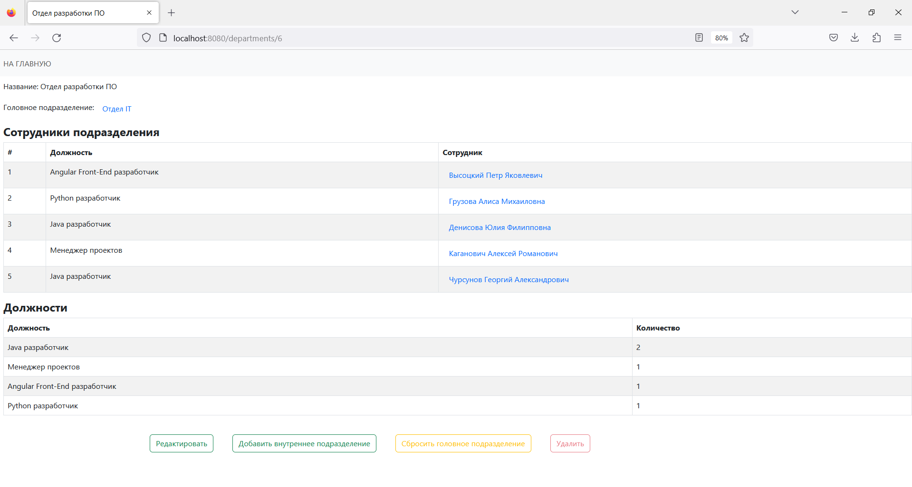

## Классы контроллеры
Находятся в пакете [controllers](../src/main/java/ru/ilichev/webprac/controllers).

`DepartmentsController` обрабатывает запросы, связанные с подразделениями,
`EmployeesController` - с сотрудниками, `JobsController` - с должностями. 

`JobHistoriesController` отвечает за назначение должностей нужному сотруднику в
нужном подразделении.

`MainController` обрабатывает запросы на главной странице.

## Представления
Код Thymeleaf представлений находится в [templates](../src/main/resources/templates).

### Список должностей
Код: [jobs/index.html](../src/main/resources/templates/jobs/index.html)

Есть поиск по названию должности.

### Информация о должности
Код: [jobs/show.html](../src/main/resources/templates/jobs/show.html)

Кнопка удаления не активна, пока есть сотрудники, занимающие эту должность.

### Форма редактирования должности
Код: [jobs/edit.html](../src/main/resources/templates/jobs/edit.html)

### Список сотрудников
Код: [employees/index.html](../src/main/resources/templates/employees/index.html)

Есть поиск по полному имени сотрудника и фильтр по общему количеству дней 
(не менее заданного числа дней) работы в компании.

### Информация о сотруднике
Код: [employees/show.html](../src/main/resources/templates/employees/show.html)

Кнопка `Назначить на новую должность` не активна, если сотрудник в данный момент занимает какую-либо должность. 
В таком случае сначала нужно снять его с текущей должности, и затем кнопка станет активной.

### Форма редактирования сотрудника
Код: [employees/edit.html](../src/main/resources/templates/employees/edit.html)

### Форма назначения сотрудника на новую должность
Код: [jobHistories/new.html](../src/main/resources/templates/jobHistories/new.html)

В select-поле `Сотрудник` доступен единственный выбор - текущий сотрудник. 

В select-поле `Подразделение` можно выбрать активное подразделение.

В select-поле `Должность` можно выбрать активную должность.

### Список подразделений
Код: [departments/index.html](../src/main/resources/templates/departments/index.html)

Есть поиск по названию подразделения.

### Информация о подразделении
Код: [departments/show.html](../src/main/resources/templates/departments/show.html)

Кнопка `Удалить` не активна, если в подразделении в данный момент кто-то работает, или у его 
есть дочерние подразделения.
Кнопка `Сбросить головное подразделение` не активна, есть такового подразделения нет.
